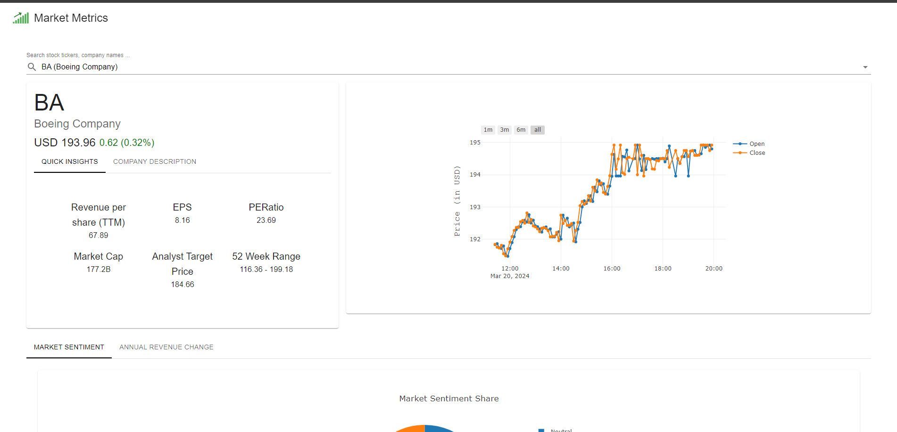
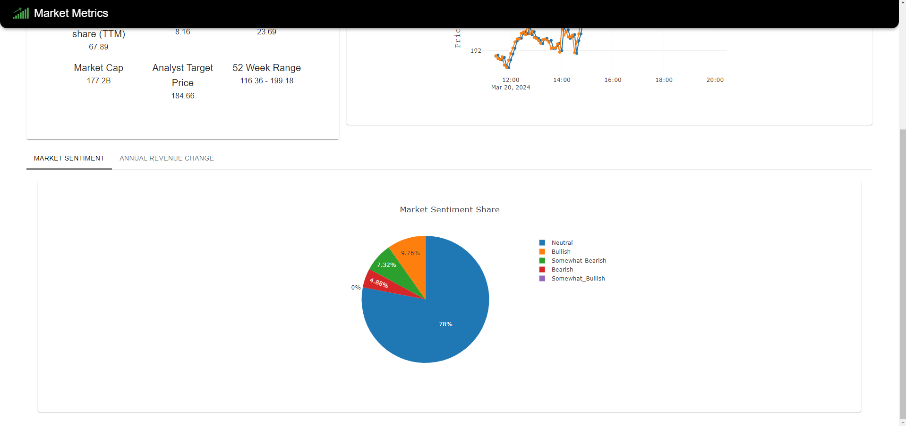
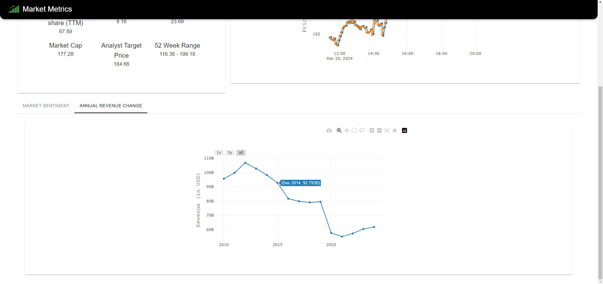

<div align="center">
  <a href="https://github.com/ayushbudh/market-metrics">
    
  </a>

  <h1 align="center">Market Metrics</h1>
  <p align="center">
    A stock data analysis web platform to view different stock related information from different stock exchanges around the world.
    <br />
    <br />
    <a href="https://github.com/ayushbudh/market-metrics/issues">Report Bug</a>
    ·
    <a href="https://github.com/ayushbudh/market-metrics/issues">Request Feature</a>
  </p>
</div>

## Table of contents
* [Introduction](#introduction)
* [Features](#features)
* [Snapshots](#snapshots)
* [Tech Stack](#tech-stack)
* [Known Issues](#known-issues)

## Introduction

Market Metrics is a comprehensive source for financial metrics and market analysis. This web application is designed to provide investors, traders, and financial enthusiasts with essential insights into various metrics crucial for evaluating stocks and understanding market trends.

## Features

Market Metrics offers a range of features to help you make informed decisions:

- Financial Metrics: Access key financial indicators such as Revenue per Share (TTM), Earnings Per Share (EPS), Price-to-Earnings Ratio (PE Ratio), Market Capitalization, Analyst Target Price, 52-Week Range, Stock Price, Stock Delta, and Stock Ticker.

- Market Sentiment: Stay updated on market sentiment, which is crucial for understanding investor confidence and market dynamics.

- Annual Revenue Change: Monitor the annual revenue change of companies to gauge their growth trajectory and financial health.

- Stock Data Charts: Visualize stock data through interactive charts, including weekly, monthly, and yearly trends. These charts provide valuable insights into historical performance and help identify patterns and trends.

## Snapshots

  
  
  

## Tech Stack

TypeScript, React.js, Material UI, React PlotlyJS, Alpha Vantage API, Jest DOM, Vite, Vitest

Code Coverage: 98.67%

## Known Issues

- ```StockInfoCard.test.tsx``` test has some flakiness where it sometimes passes and sometimes fails.